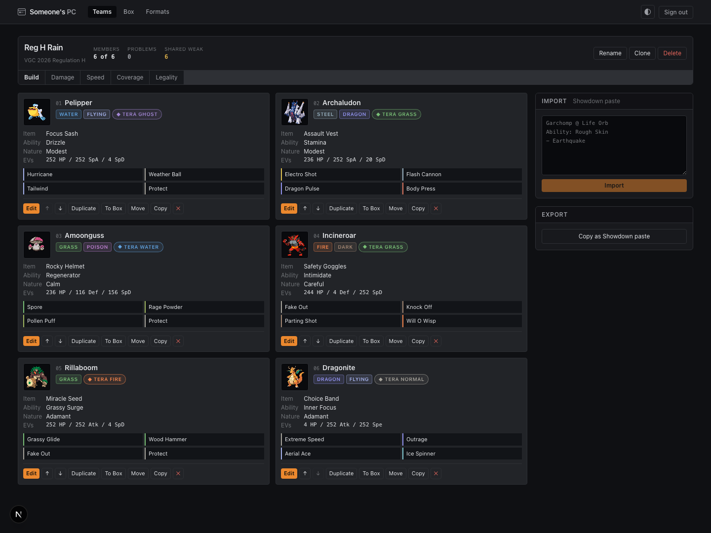
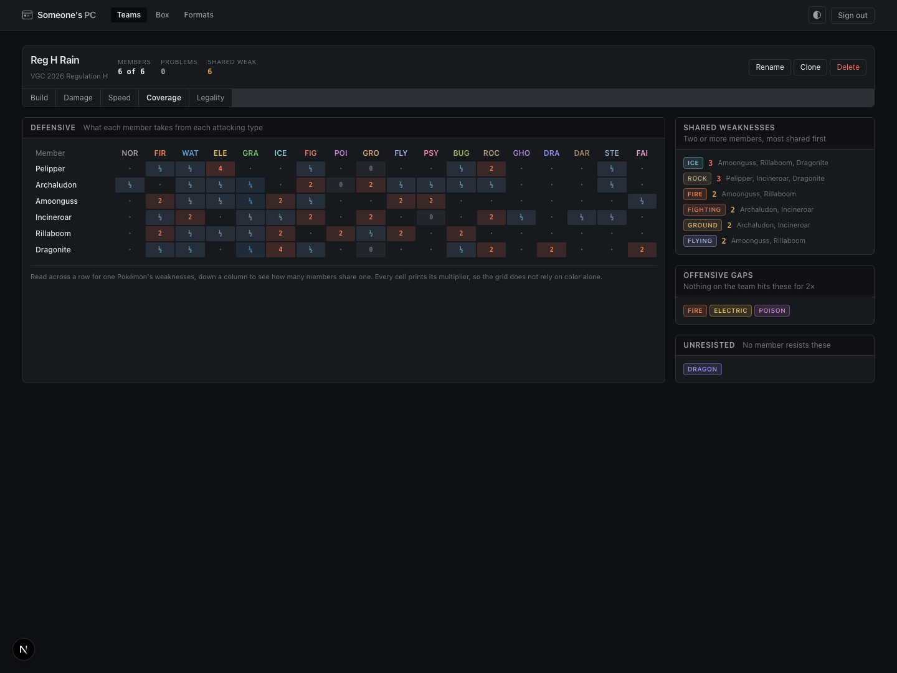
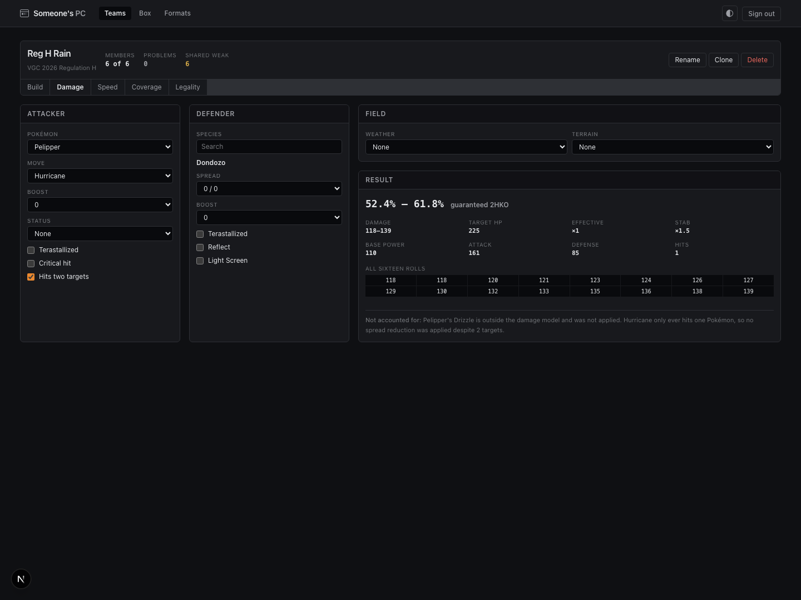

# Someone's PC

**A team-building planning companion for competitive Pokémon.**

It keeps a library of sets, arranges them into teams under a chosen format, and reports what the
team can do — damage rolls, speed tiers, coverage gaps, and whether it is legal where you mean to
play it. It covers VGC doubles and Smogon singles.

_Most of this page is written in the vocabulary of competitive play. There is a
[glossary](#the-vocabulary) below that maps each term to the type that models it, and if you are
here for the code, start at [Technical skeleton](#technical-skeleton)._



_The bench. Six slots, the format's rules applied live, and the three numbers a builder checks
most: how full the team is, how many rules it breaks, and how concentrated its weaknesses are._

---

## What it does

**The Box** is a library of saved sets — the thing most builders end up keeping by hand in a text
file. **The Bench** is where one team gets built: six slots under one format, with the analysis
attached.

Sets are **copied** between the two, never shared by reference. A set pulled from the Box into a
team is a snapshot, and editing it there does not reach back into the Box. Sharing them by
reference would mean editing one team quietly changes another.

Four analysis panels, each a pure function of the team as it stands:

| Panel        | What it answers                                                                    |
| ------------ | ---------------------------------------------------------------------------------- |
| **Damage**   | The Gen 9 chain, rounding where the games round. Sixteen rolls, spread, Tera STAB. |
| **Speed**    | Where each member sits against benchmarks, with Scarf, Tailwind and Booster.       |
| **Coverage** | What the team's moves hit, and what several members share a weakness to.           |
| **Legality** | Every violated rule, named, with the source of that rule beside it.                |



_Every cell prints its multiplier, so the grid never relies on color alone. Read across a row for
one Pokémon's weaknesses, down a column to count how many members share one._



_The calculator returns all sixteen rolls. It runs in the browser against a `Dex` built from the
few records the calculation touches, so changing the weather costs no request._

Teams import and export as Showdown pastes, which is how the ecosystem already shares them.

---

## The vocabulary

Competitive Pokémon has its own terms, and most of the app's domain model is a direct translation
of them. If any of the copy above was opaque, this is the decoder ring.

| Term               | What it means to a player                                                                                                                 | What models it                                     |
| ------------------ | ----------------------------------------------------------------------------------------------------------------------------------------- | -------------------------------------------------- |
| **Set**            | One configured Pokémon: species, ability, item, nature, four moves, a stat spread. The unit of team-building.                             | `PokemonSet` — `core/src/set.ts`                   |
| **EVs / IVs**      | The two stat budgets. 508 EVs to distribute, 252 to any one stat; IVs are fixed per Pokémon, 0–31.                                        | `StatSpread` — `core/src/stats.ts`                 |
| **Nature**         | A ±10% trade between two stats. Adamant buys Attack with Special Attack.                                                                  | `Nature`, `natureMultiplier` — `core/src/stats.ts` |
| **Format**         | The ruleset you play under: team size, level, legal species, banned moves, clauses. VGC calls these regulations, Smogon calls them tiers. | `Format` — `core/src/format.ts`                    |
| **Clause**         | A rule about the team rather than about a species — no two of the same Pokémon, no two of the same item.                                  | `Clause` — `core/src/format.ts`                    |
| **STAB**           | Same-Type Attack Bonus. A move matching the user's own type deals 1.5×.                                                                   | `core/src/damage/stab.ts`                          |
| **Tera**           | Generation 9's gimmick: change a Pokémon's type mid-battle, which reshapes both its STAB and what it resists.                             | `core/src/damage/stab.ts`, five cases              |
| **Roll**           | Damage is randomized across sixteen outcomes, 85%–100%. "Low roll" and "high roll" mean the ends of that range.                           | `DamageResult.rolls` — `core/src/damage/`          |
| **2HKO**           | Knocks the target out in two hits. Results are quoted this way, along with how many of the sixteen rolls manage it.                       | `core/src/damage/ko.ts`                            |
| **Spread move**    | Hits more than one opponent, and takes a 0.75× penalty for it. Only matters in doubles.                                                   | `isSpreadMove` — `core/src/move.ts`                |
| **Speed tier**     | The ordered list of how fast everything is. Winning a tie decides who moves first, so builders tune to specific numbers.                  | `core/src/analysis/speed.ts`                       |
| **Coverage**       | Which types the team can hit hard, and which types can hit the team hard.                                                                 | `core/src/analysis/coverage.ts`                    |
| **Showdown paste** | The plain-text format Pokémon Showdown uses to write out a team. The way this ecosystem already shares them.                              | `core/src/showdown/`                               |

---

## Run it

```bash
pnpm setup          # install, start postgres, push the schema, seed a demo account
pnpm dev            # http://localhost:3000
```

`pnpm setup` needs Docker for Postgres. It seeds an account with three real teams in it:

```
demo@someones.pc / competitive
```

To point at your own Postgres instead, copy `apps/web/.env.example` to `apps/web/.env.local`,
set `DATABASE_URL`, and run `pnpm db:push && pnpm db:seed`. That is the only env file `pnpm dev`,
`db:push` and `db:seed` read, and `DATABASE_URL` is the only variable any of them looks for.

### Commands

```bash
pnpm dev            # web app
pnpm test           # vitest, all packages
pnpm test:e2e       # playwright
pnpm typecheck      # tsc --noEmit across the workspace
pnpm lint           # eslint + prettier
pnpm fix            # autofix both
pnpm check          # typecheck + lint + test
pnpm ingest         # rebuild the dataset from PokéAPI
```

---

## Technical skeleton

A pnpm workspace, TypeScript throughout, strict plus `noUncheckedIndexedAccess` and
`exactOptionalPropertyTypes`.

```
packages/core/     domain types, the calculator, analysis, Showdown I/O. pure.
packages/dex/      the PokéAPI client, the ingest pipeline, the built dataset.
apps/web/          Next.js 16 + React 19, Postgres via Drizzle, session auth.
```

Dependencies flow one way: **web → dex → core**.

**The core is pure.** No clock, no ambient randomness, no I/O, enforced by lint. Two things
follow. Every calculator test is a plain assertion against a fixture, with no mocks and no flake.
And the calculator cannot roll dice, so it returns all sixteen rolls and lets the caller decide —
which is what a player wants to read anyway.

**`core` declares the data it needs and never learns where it comes from.** `Dex` is an interface
in `core/src/dex.ts`. `@spc/dex` implements it against the built dataset, the test suite
implements it against a hand-built fixture, and the browser implements it against the few
records the current calculation touches. That inversion is why the calculator is testable without
loading a thousand forms.

**Format is a parameter, never a branch.** Nothing anywhere reads a format id and switches on it.
A `Format` declares its team size, level rule, gimmick, clauses and legality, and callers ask the
format. Adding a regulation is a data change.

**The dataset is built, not fetched.** `pnpm ingest` walks PokéAPI once, validates every response
with zod, normalizes it into the domain types, and writes a compact dataset that is committed to
the repo. The app reads it synchronously. Fetching at runtime would be slow, rate-limited, and
would make CI depend on someone else's uptime.

---

## What the data covers

Several answers here are approximations. The app names each one wherever it shows it, and they
are worth knowing before you rely on the output.

- **Legality is curated.** PokéAPI has no concept of a tier or a regulation, so every banlist is
  transcribed by hand. Each format carries its authority, a citation and the date it was last
  checked, displayed next to every verdict. Check the official rules before a tournament.
- **Which Pokémon Generation 9 holds is read from the data, not transcribed.** A form counts as
  usable only where PokéAPI lists a move for it in Scarlet and Violet, which leaves 869 of the
  1,351 forms in the dataset. Four forms the games only ever produce during a battle or through
  an event are corrected by hand, and the source names each one. Mega Evolution is not in these
  games, so no format has to ban it.
- **Four of the seven clauses are checked**: Species, Item, OHKO and Evasion. Sleep and Endless
  Battle are decided during a battle and nothing about a team could answer them. The Nickname
  Clause is not checked.
- **Learnsets are absolute.** A move is listed if the species, or any of its pre-evolutions, can
  learn it in Generation 9 by any route — a Pokémon keeps what it knew before it evolved, which is
  how Kingambit gets Pawniard's Sucker Punch. Breeding chains, event distributions and version
  exclusives are not modelled, so the picker does not know whether a given save file can legally
  produce the set.
- **The damage calculator models a curated list of items and abilities**, and its rolls are checked
  match-up by match-up against `@smogon/calc` in the test suite. A result names what it could not
  account for: an item or ability outside the model, or a power that turns on a turn order or a
  battle history the app does not hold. **Intimidate is assumed to have triggered** — a defender
  carrying it takes a stage off the attacker's Attack on every calculation, which the result says
  out loud, because the question a team builder asks is what happens after the switch. The
  attacker's ability decides what the stage becomes — Simple doubles it, Contrary reverses it,
  Defiant and Competitive answer it, Clear Body, White Smoke, Full Metal Body, Hyper Cutter, Inner
  Focus, Own Tempo and Oblivious block it, Guard Dog turns it into a raise — and the result says
  that too. A Mold Breaker attacker does not stop it, because Mold Breaker reaches the execution of
  a move and Intimidate happened on entry. Intimidate is the one place the calculator deliberately
  reads a match-up differently from `@smogon/calc`, apart from a corner the games decide: an
  attacker already at -6 Attack cannot be lowered again, so Defiant, Competitive and Guard Dog have
  nothing to answer. **The moves that bend the formula are read the way the games read them.** Foul
  Play attacks with the target's Attack and the target's stages; Shell Side Arm takes whichever side
  would do more to this target, counting stat stages and nothing else. Both say what they read, and
  Shell Side Arm says when the two sides come out level, which the games settle with a coin flip and
  nothing here can. Foul Play names what it leaves out too: the user's own Intimidate would take a
  stage off the Attack it reads, and only a stage landed on the attacker is modelled.
- **Speed benchmarks come from base stats at maximum investment with a Speed-raising nature.**
  They are not filtered by usage statistics.
- **Coverage scores against whole typings, not one type at a time**, and ability immunities move
  the defensive grid. Four things it does not do: it reads each move at its printed type, so Tera
  Blast's type change is not modelled; an ability that changes a hit without changing the chart,
  Thick Fat say, is named in the notes rather than folded into a multiplier; the defensive grid
  uses each member's printed typing, because Terastallizing changes one member once; and the
  offensive reading is against typing alone, because the other side's abilities cannot be known
  from here — Levitate zeroes a Ground move the panel counts as a hit.

Not in scope: usage statistics, team suggestions, battle simulation, and sharing or social
features. The app reports on the team in front of it.

---

## History

Someone's PC began in 2023 as a group project at General Assembly's Software Engineering
Immersive, built with Anthony Blalock and Ciaran Kearney — Express, EJS and Mongo, a box of
sprites, and named teams saved against a login. Later that year I rebuilt it on my own as a REST
API and a React front end, which added EVs, IVs, the real stat formula, and drag-and-drop between
the box and the party.

Both stopped short of moves and formats, which is where planning a competitive team actually
begins. This version picks up there: four-move sets, formats as data, and analysis that reads a
finished team back to you.

---

## License

MIT
